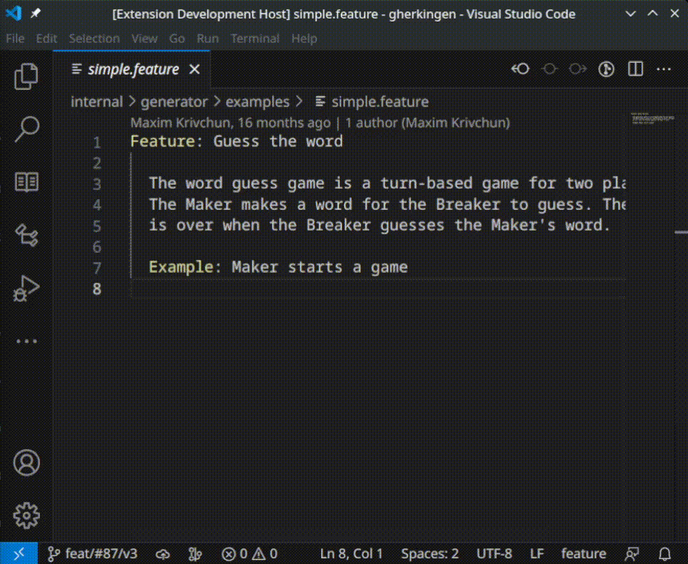
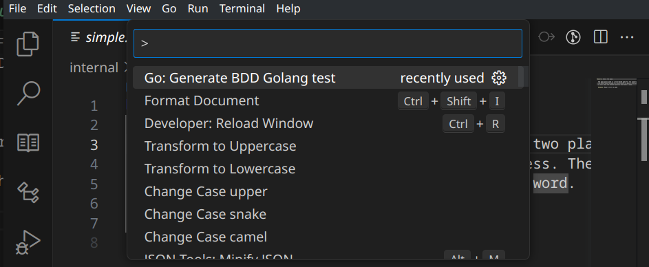
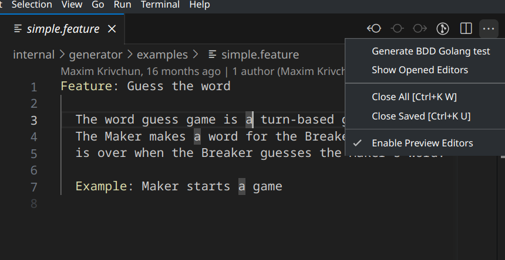

# golang-gherkingen README

It is an extension for VS-Code that helps to generate Behaviour Driven Development (BDD) boilerplate Golang tests.

## Features

- Generate a golang test boilerplate from *.feature Cucumber/Gherkin files by a single click.
- It uses [this](https://github.com/hedhyw/gherkingen) generator.

## Usage

- Open the command palette (Ctrl+Shift+P or Cmd+Shift+P) and search for "Go: Generate BDD Golang test".
    

- Click the button in the editor's menu:
    

## Requirements

- Rootless `docker` is required in order to run [the generator's image](https://hub.docker.com/r/hedhyw/gherkingen).

## Extension Settings

No settings.

## Known Issues

No known issues.

## Release Notes

### 1.0.0

Initial release of golang-gherkingen.

### 1.0.1

Update [gherkingen](https://github.com/hedhyw/gherkingen) generator to the version v3.0.2.

### 1.0.2

Update [gherkingen](https://github.com/hedhyw/gherkingen) generator to the version v3.0.3.
