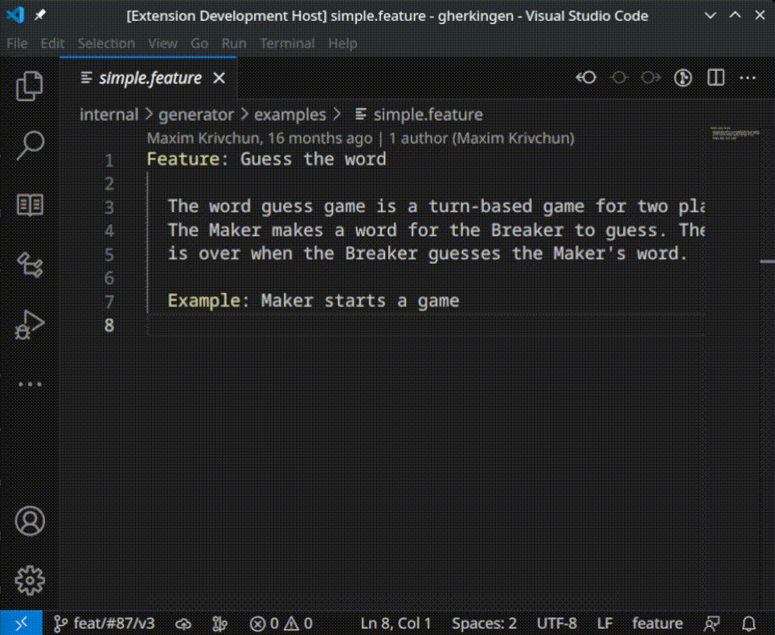
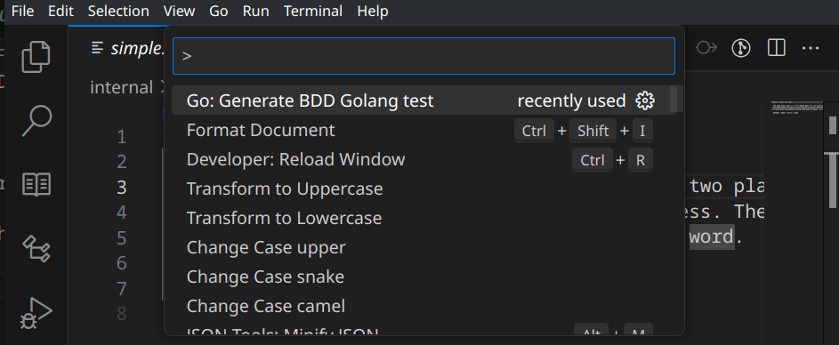
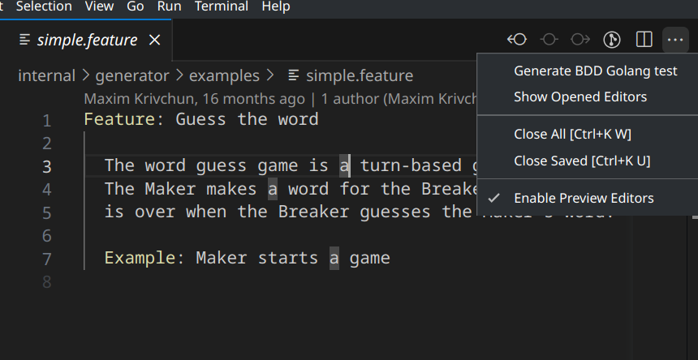

# golang-gherkingen README

It is an extension for VS-Code that helps to generate Behaviour Driven Development (BDD) boilerplate Golang tests.

## Features

- Generate a golang test boilerplate from *.feature Cucumber/Gherkin files by a single click.
- It uses [this](https://github.com/hedhyw/gherkingen) generator.

## Usage

- Open the command palette (Ctrl+Shift+P or Cmd+Shift+P) and search for "Go: Generate BDD Golang test".
    

- Click the button in the editor's menu:
    

## Requirements

- Rootless `docker` is required in order to run [the generator's image](https://hub.docker.com/r/hedhyw/gherkingen).

## Extension Settings

- `golang-gherkingen.feature.language` — the natural language used to describe the feature (optional; it can also be derived from the file name, e.g. `<description>.<language_hint>.feature`).

## Known Issues

No known issues.

## Development

- `npm ci` — install dependencies.
- `npm run compile` — compile TypeScript to `out/` (or `npm run watch`).
- `npm run lint` — run ESLint.
- `npm test` — run integration tests (downloads VS Code; on headless Linux use `xvfb-run -a npm test`).
- `npx @vscode/vsce package` — build the `.vsix` package.

Press `F5` in VS Code to launch an Extension Development Host.

## Release Notes

### 1.0.0

Initial release of golang-gherkingen.

### 1.0.1

Update [gherkingen](https://github.com/hedhyw/gherkingen) generator to the version v3.0.2.

### 1.0.2

Update [gherkingen](https://github.com/hedhyw/gherkingen) generator to the version v3.0.3.

### 1.0.3

Update [gherkingen](https://github.com/hedhyw/gherkingen) generator to the version v4.0.0.
